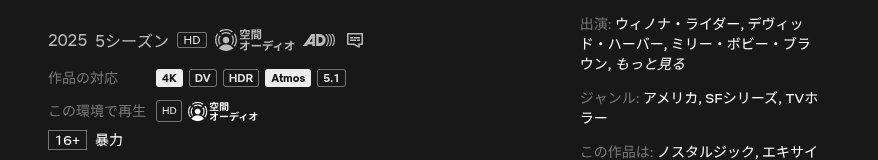

# Netflix Quality Badges

A Chrome extension that shows which formats a Netflix title is available in — 4K, Dolby Vision, HDR, Dolby Atmos and 5.1 — right on the title cards, even on devices that cannot play them.


Netflix itself only shows what your current device and plan can play, so a 4K Dolby Atmos title looks like plain "HD" in a desktop browser. The title details and hover previews therefore show both side by side: what the title is available in, and what is playable here.



## How it works

The Netflix web app already receives each title's `playbackBadges` in the GraphQL responses it fetches to render the browse and search pages. The extension observes those responses and draws the badges onto the matching title cards.

It never sends requests of its own, so Netflix sees exactly the same traffic as without the extension.

| Badge | Meaning |
| --- | --- |
| 4K / HD / SD | Highest available resolution |
| DV | Dolby Vision |
| HDR | HDR10 or HDR10+ |
| Atmos | Dolby Atmos |
| 5.1 | 5.1 surround |

The badges describe what the title is offered in. Actually watching in 4K or Atmos still requires a plan and a device that support it.

## Releasing

Push a `v*` tag and the release workflow builds the extension and attaches the zip to a GitHub release.

## Install

1. Download the latest `netflix-quality-badges-*.zip` from [Releases](https://github.com/tomocrafter/netflix-quality-badges/releases) and unzip it.
2. Open `chrome://extensions` and enable Developer mode.
3. Choose **Load unpacked** and select the unzipped directory.

To build from source instead, run `bun install && bun run build` and load the `dist` directory.

## Development

```sh
bun run lint       # oxlint
bun run typecheck  # tsc
bun run build      # bundle into dist/
bun run check      # all of the above
```

## Disclaimer

This project is not affiliated with or endorsed by Netflix.

## License

[MIT](LICENSE)
